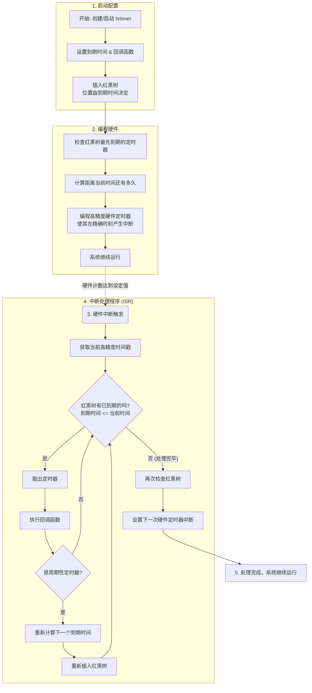
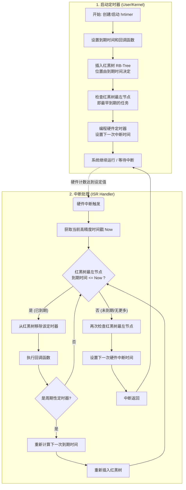

# NerdRTOS定时器系统设计说明

## 设计概述

定时器管理是操作系统内核中一个至关重要的子系统，它为系统的稳定运行和应用程序的精确时间控制提供了基础支持。其意义主要体现在以下两个方面：
- 提供时间基准
- 为延时和超时操作提供基础

---

##  运行模式架构

NerdRTOS 支持两种不同的定时器管理模式。

#### 传统节拍模式

传统节拍模式是 RTOS 的经典实现方式。当 `ND_CFG_TICKLESS` 配置为 0 时启用。

**核心机制__：系统配置一个固定频率的硬件定时器产生周期性的节拍中断（Tick Interrupt）。内核维护一个全局的节拍计数器，以此作为系统时间的基本单位。无论是否有定时器即将到期，节拍中断都会按时发生，内核在中断中检查并处理到期任务。

__数据结构__：所有活动定时器按照到期时间（以节拍数为单位）组织成一个__红黑树__。尽管传统 RTOS 设计常使用链表，但 NerdRTOS 在此模式下依然统一采用红黑树，保证了在定时器数量较多时，插入和查找的高效性（复杂度 ）。

__工作流程__：

__周期中断__：硬件定时器以预设的固定频率（如每 1ms）持续触发中断。
__计数维护__：每次中断发生时，内核将全局系统节拍计数器加一。
__轮询处理__：中断处理程序检查红黑树上__最先到期__的定时器，若当前节拍数已达到设定值，则执行相应处理。

__优点__:

* __实现简单__：实现简单，逻辑清晰，不涉及复杂的硬件驱动编程。
* __开销稳定__：不需要频繁计算时间差和重设硬件寄存器。


__工作流程__：

* 用户或内核代码创建定时器，根据当前节拍数计算出目标到期节拍（Current Tick + Timeout），将其插入红黑树中。
* 硬件定时器不断产生固定的周期性中断，这是系统心跳的来源。
* 中断处理程序被周期性调用。
* 全局节拍计数器 `nd_tick_count` 递增。
* 检查红黑树的最左节点（即最早到期的任务）。
* 如果 `当前节拍 >= 节点到期节拍`，则从红黑树中移除该定时器并执行其回调函数。此过程循环进行，直到最左节点未过期为止。
* 如果是周期性定时器，则基于当前节拍计算下一次到期节拍，并将其重新插入红黑树。
* 退出中断，系统继续运行，等待下一个固定的节拍中断到来。

__流程图__:


#### 高精度定时器模式

高精度定时器旨在满足现代应用对微秒/纳秒级时间精度的需求。当 `ND_CFG_TICKLESS` 配置为 1 时启用。

__核心机制__ :利用高精度硬件时钟源、采用基于到期时间的红黑树数据结构、并动态编程硬件定时器以产生精确的单次中断，摆脱了对固定节拍中断的依赖。
__数据结构__：所有活动定时器按照到期时间（绝对时间）组织成一个红黑树。这种结构保证了插入、删除和查找最短到期时间的操作复杂度仅为 ，非常高效且可扩展。

__优点__:
- 高精度：理论上可达纳秒级精度（受限于硬件和系统负载）。
.
__工作流程__：
- 创建/启动定时器：用户或内核代码创建一个 hrtimer，设置其到期时间（绝对时间）和回调函数。该定时器被插入到红黑树中，位置由其到期时间决定。
- 设置下一次中断：内核检查红黑树上最先到期的定时器，计算出距离当前时间还有多久。然后，编程高精度硬件定时器，使其在精确的到期时刻产生一个中断。
- 硬件中断触发：当硬件定时器计数达到设定值时，产生中断。
- 中断处理：
    - 中断处理程序被调用。
    - 它获取当前高精度时间戳。
    - 从红黑树中取出所有已到期（到期时间 <= 当前时间）的定时器（可能不止一个）。
    - 对每个到期的定时器，执行其回调函数。
    - 如果是周期性定时器，则重新计算下一个到期时间，并将其重新插入红黑树。
    - 最后，再次检查红黑树，设置下一次硬件定时器中断的时间。
- 处理完成，系统继续运行。

__流程图__:


---

##  API 接口说明

NerdRTOS 提供了一套简洁的 API 来管理定时器，屏蔽了底层 Tick 与 Tickless 模式的差异。

####  `nd_timer_init`

初始化定时器控制块，设置其基本属性。

* **函数原型**：
```c
nd_err_t nd_timer_init(nd_timer_t *timer,
                       const char *name,
                       nd_timer_type_t type,
                       nd_uint64_t timeout,
                       void (*callback)(void *arg),
                       void *arg);
```

 **参数说明**：
* `timer`: 指向定时器控制块的指针。
* `name`: 定时器名称（用于调试，最大长度受 `ND_NAME_MAX_SIZE` 限制）。
* `type`: 定时器类型，可选：
* `ND_TIMER_TYPE_ONE_SHOT`: 单次触发。
* `ND_TIMER_TYPE_PERIODIC`: 周期性触发。

* `timeout`: 超时时间值。
* `callback`: 超时后执行的回调函数指针。
* `arg`: 传递给回调函数的用户参数。

**返回值**：
* `ND_EOK` (0): 初始化成功。
* `ND_EINVAL`: 参数错误（如 `timer` 为空，`callback` 为空，或 `timeout` 为 0）。

#### 2. `nd_timer_start`

启动定时器，将其插入到系统的红黑树中开始计时。

**函数原型**：
```c
nd_err_t nd_timer_start(nd_timer_t *timer);
```

 **参数说明**：
* `timer`: 指向已初始化的定时器控制块指针。

 **返回值**：
* `ND_EOK`: 启动成功。
* `ND_EINVAL`: 参数错误（如 `timer` 为空）。

#### 3. `nd_timer_stop`

停止定时器，将其从系统的红黑树中移除。

  **函数原型**：
```c
nd_err_t nd_timer_stop(nd_timer_t *timer);
```

**参数说明**：
* `timer`: 指向定时器控制块指针。

**返回值**：
* `ND_EOK`: 停止成功。
* `ND_EINVAL`: 参数错误。
