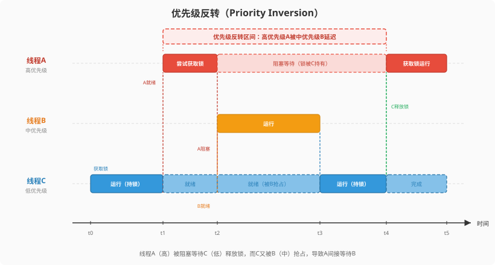
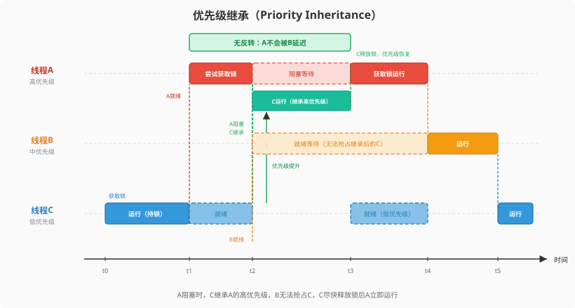

# IPC设计
在多线程环境中，线程并非孤立运行。它们共享处理器时间与内存资源，在调度器的驱动下并发执行。
这种并发带来了两个基本问题：
- **执行时序的协调**：当线程之间存在先后依赖或互斥访问需求时，需要一种机制来约束它们的执行顺序
- **数据的传递**：线程产生的数据需要交给另一个线程处理时，需要一条安全的通道来完成交接

RTOS内核为解决这两类问题所提供的机制，统称为**IPC（Inter-Process Communication，线程间通信）**。

IPC通常包含两个方面：同步机制，用于协调线程间的执行时序；通信机制，用于在线程间传递数据。

NerdRTOS暂时提供了信号量、互斥量、队列和事件组。

## 信号量
信号量是一种轻型的用于解决线程间同步问题的内核对象，线程可以获取或释放它，从而达到同步或互斥的目的。

#### 信号量控制块
信号量控制块结构详细定义如下：
``` c
typedef struct nd_sem {
    nd_int32_t val;       /* 信号量的值 */
    nd_list_t wait_list;  /* 信号量的等待列表 */
} nd_sem_t;
```
#### 信号量初始化
创建信号量通过下面这个接口：
``` c
void nd_sem_init(nd_sem_t *sem, nd_int32_t init_val);
```
调用这个函数会对这个 semaphore 对象进行初始化，将计数值设置为 init_val，并初始化等待链表。

#### 获取信号量
获取信号量使用下面的函数接口：
``` c
nd_err_t nd_sem_take(nd_sem_t *sem, nd_uint64_t timeout);
```
根据信号量的值分为两种情况：
- **当信号量的值大于0时**，直接获取信号量，并且将信号量的值减1。
- **当信号量的值等于0时**，通过判断`timeout`参数来确定具体的执行：
  - **`timeout == ND_TIMEOUT_NOWAIT`**：无需等待，直接返回**ND_EBUSY**。
  - **`timeout == ND_TIMEOUT_FOREVER`**:需要永久等待，将线程设置为block并推出，只能通过别的线程释放资源唤醒。
  - **其他值**：启动超时定时器。

#### 释放信号量
释放信号量使用下面的接口函数：
``` c
nd_err_t nd_sem_release(nd_sem_t *sem);
```
- 根据信号量的等待列表是否为空，分为两种情况：
  - **等待列表为空**，直接信号量的计数值的值加一。
  - **等待列表不为空**，把等待队列中的第一个线程设为就绪`ND_THREAD_STAT_READY`，从信号量的等待列表中**摘除**，插入就绪队列的头部（为了刚唤醒的线程尽快获得CPU）。

## 互斥量
互斥量又叫相互排斥的信号量，是一种特殊的二值信号量。
### 互斥量控制块
互斥量控制块结构详细定义如下：
``` c
typedef struct nd_mutex {
    nd_uint8_t  priority;   /* 记录等待该互斥量的线程中的最高优先级，用于优先级继承 */
    nd_thread_t *owner;     /* 当前持有该互斥量的线程指针 */
    nd_list_t   wait_list;  /* 互斥量的等待列表头结点 */
    nd_list_t   owner_list; /* 链表节点，用于挂到 owner 线程的 taken_list 链表上 */
} nd_mutex_t;
```
### 优先级反转
假设线程H（高）、M（中）、L（低）。L先获取了锁，H就绪后抢占L去拿锁，但锁被L持有，H被阻塞。此时M就绪，由于M优先级比L高，M抢占了L运行。结果就是：高优先级的H本来只需要等L释放锁，但L被M抢占了没法运行，H被迫间接等待比自己优先级低的M，优先级关系被反转了。

解决优先级继承常见的解决办法有两种：
- **优先级天花板**：给每个互斥量预先设定一个优先级天花板（通常等于所有可能用该锁的线程中的最高的优先级）。任何线程获取锁后，优先级立即提升到天花板值。**优点**：简单直接，不需要等到冲突才提升。**缺点**：没有竞争也会提升优先级，造成不必要的调度开销，而且需要预先知道哪个线程会使用这个锁。
- **优先级继承**：只有当高优先级线实际被阻塞的时候，才把持锁线程的优先级提升到等待的高优先级线程的优先级。不需要预先配置，按需提升，用完恢复。

NerdRTOS选择使用**优先级继承**，原因是：
- **按需生效**：只有在真正发生优先级反转的时候才提升，节省开销。
- **无需预先配置**:不需要为每个互斥量指定天花板值，使用更简单。



### 优先级继承
优先级继承是解决优先级反转的一种方法。

当A尝试获取锁失败被阻塞时，内核把持锁者L的优先级临时提升到和H一样高。这样M就绪时发现L的优先级不比自己低，无法抢占L。L得以尽快完成临界区、释放锁，H立即获取锁运行。锁释放后，L的优先级恢复原值。整个过程中H不会被M延迟。


### 互斥量初始化
创建互斥量通过下面这个接口：
``` c
void nd_mutex_init(nd_mutex_t *mutex);
```
调用这个函数会对互斥量对象进行初始化，把`owner`设置为空，锁的优先级设置为最大值（最低优先级）。

### 释放互斥量
释放互斥量通过下面这个接口：
``` c
nd_err_t nd_mutex_unlock(nd_mutex_t *mutex);
```
- **权限检查**：判断持锁者是否为当前线程，如果不是返回`ND_EPERM`，避免被非持锁者意外释放。
- **锁的转移或释放**：判断等待队列状态分两种情况：
  - **无等待者**：将 owner 置为 `ND_NULL`，`priority `
重置为`ND_THREAD_PRIORITY_MAX`（最低优先级），锁回到空闲状态。
  - **有等待者**：等待队列中最高优先级的线程，设置为`ND_THREAD_STAT_READY`，并将其设为新的持有者，将锁插入新持有者的 `taken_list`，随后触发调度。
- **优先级恢复**：调用 `nd_mutex_restore_priority`，根据当前线程仍持有的其他锁重新计算其应有的优先级。

### 获取互斥量
获取互斥量通过下面这个接口：
``` c
nd_err_t nd_mutex_lock(nd_mutex_t *mutex, nd_uint64_t timeout);
```
分为两种情况：
- **无人持锁**：直接获取互斥锁，将`mutex->owner`设为当前线程，并把`mutex`挂到当前线程的`taken_list`上。
- **有人持锁**：根据`timeout参数具体`来确定具体的执行：
  - **`timeout == ND_TIMEOUT_NOWAIT`**：无需等待，直接返回**ND_EBUSY**。
  - **`timeout == ND_TIMEOUT_FOREVER`**:需要永久等待，将线程设置为block并推出，只能通过别的线程释放资源唤醒。
  - **其他值**：启动超时定时器。

## 消息队列
线程间通信最常见的需求是：一个线程产生固定大小的消息，另一个线程消费。需要支持阻塞等待和超时机制。
NerdRTOS采用定长消息的环形缓冲区实现，创建时指定消息大小和队列深度。深度要求为 2 的幂，以便用位掩码替代取模运算。
### 消息队列控制块
消息队列控制块结构详细定义如下：
``` c
typedef struct nd_queue {
    char         *buf;      /* 外部提供的缓冲区指针 */
    nd_uint32_t  msg_size;  /* 每条消息固定大小 */
    nd_uint32_t  max_msgs;  /* 队列最大消息数，必须是2的幂 */
    nd_uint32_t  used_msg;  /* 当前队列的的消息数量 */
    nd_uint32_t  read_ptr;  /* 读索引 */
    nd_uint32_t  write_ptr; /* 写索引 */

    nd_list_t   send_wait;  /* 发送等待队列 （队列满）*/
    nd_list_t   read_wait;  /* 接收等待队列（接收为空）*/
} nd_queue_t;
```
### 消息队列初始化
队列初始化通过下面这个接口：
``` c
nd_err_t nd_queue_init(nd_queue_t *queue, char *buf, nd_uint32_t msg_size, nd_uint32_t max_msgs);
```
调用这个函数会把队列对象进行初始化，各参数含义如下：
- `buf`:用户提供的缓冲区，队列的消息数据将存储在这块内存中。
- `msg_size`：单条消息的大小（字节）。
- `max_msgs`：队列最多容纳的消息条数，必须为2的幂，否则返回`ND_EINVAL`

> 要求 max_msgs 为2的幂次，是为了在读写时用位掩码 `ptr & (max_msgs - 1)` 替代取模运算，实现零开销的环形索引回绕。取模指令（除法）在很多 MCU 上要几十个周期，有些架构（如 Cortex-M0）没有硬件除法指令，需要软件模拟。位掩码（&(n-1)）只要 1 个周期。

### 发送消息队列
发送消息队列通过下面这个接口：
``` c
nd_err_t nd_queue_send(nd_queue_t *queue, void *c, nd_uint64_t timeout);
```
- **队列满时等待**：`queue->used_msg == queue->max_msgs`判断队列消息是否满了，如果满了，根据timeout参数具体执行：
  - **`timeout == ND_TIMEOUT_NOWAIT`**：直接返回`ND_EFULL`。
  - **`timeout == ND_TIMEOUT_FOREVER`**：把当前线程挂到`send_wait`等待链表上，并设`ND_THREAD_STAT_BLOCK`。
  - **其他值**：启动超时定时器。
- **消息写入**：把用户数据拷贝到对应槽位，推进写指针和已用计数。
- **唤醒等待接收的线程**：如果有线程在`read_wait`上等待，唤醒并触发调度。

### 接收消息队列
接收消息队列通过下面这个接口：
``` c
nd_err_t nd_queue_recv(nd_queue_t *queue, void *buf, nd_uint64_t timeout);
```
- **判断消息队列是否为空**：如果消息队列为空，根据timeout参数决定具体的情况：
  - **`timeout == ND_TIMEOUT_NOWAIT`**：直接返回`ND_EEMPTY`。
  - **`timeout == ND_TIMEOUT_FOREVER`**：把当前线程挂到`read_wait`等待链表上，并设`ND_THREAD_STAT_BLOCK`。
  - **其他值**：启动超时定时器。
  随后触发调度，并且判断是否超时。
- **把用户数据拷贝到对应槽位，推进写指针和已用计数。**
- **唤醒因为消息满了而挂起的线程**：如果有线程在`send_wait`上等待，唤醒并触发调度。

## 事件组
一个事件组可以包含多个事件，事件集可以用于完成一对多，多对多的线程间同步。线程通过**AND**或**OR**将一个或多个事件关联起来，形成事件组合。事件的**OR**指的是线程与任何事件之一发生同步；事件的**AND**指的是线程与若干事件都发生同步。
### 事件组控制块
事件控制块结构详细定义如下：
``` c
typedef struct nd_event {
    nd_uint32_t set;        /* 32位事件标志位，每一个bit代表一个事件 */
    nd_list_t   wait_list;  /* 事件的等待列表 */
} nd_event_t;
```
### 事件组初始化
事件组初始化通过下面这个接口：
``` c
void nd_event_init(nd_event_t *event);
```
调用这个函数会对这个`event`对象进行初始化，将`set`清零，并初始化等待链表。

### 发送事件
发送事件通过调用下面这个接口：
``` c
nd_err_t nd_event_send(nd_event_t *event, nd_uint32_t set);
```
- **置位事件标志**：`event->set |= set;`,通过**逻辑或**来置位事件标志。
- **遍历等待链表**：对每个等待列表进行检查，分为两种情况：
  - **AND模式**：`if ((event->set & thread->event_set) == thread->event_set)`，通过逻辑与来检查线程所有关心的位是否都置位了，将线程从等待列表中移除，停止超时定时器，设为`ND_THREAD_STAT_READY`，加入就绪列表尾部。
  - **OR模式**：`if ((event->set & thread->event_set) != 0)`，通过逻辑与来判断是否是否有一个置位，是的话直接把该线程从等待列表中移除，设为`ND_THREAD_STAT_READY`，加入就绪列表尾部。

#### 接收事件
接收事件通过下面这个接口：
``` c
nd_err_t nd_event_recv(nd_event_t *event, nd_uint32_t set,
                       nd_event_opt_t opt, nd_uint64_t timeout);
```
- **保存等待参数**：将 `set` 和 `opt` 保存到当前线程TCB中，供 `nd_event_send` 遍历时读取。
- **检查条件是否已满足**：分为两种情况：
  - **AND模式**：`if ((event->set & set) == set)`，检查线程关心的所有位是否都已置位，是的话直接返回 `ND_EOK`。
  - **OR模式**：`if ((event->set & set) != 0)`，检查线程关心的位中是否有任意一个已置位，是的话直接返回 `ND_EOK`。
- **条件不满足时**：
  - 如果 `timeout == ND_TIMEOUT_NOWAIT`，不阻塞，立即返回 `ND_EBUSY`。
  - 否则调用 `nd_ipc_suspend` 将当前线程挂到等待链表上，状态设为 `ND_THREAD_STAT_BLOCK`，若 timeout 非 `ND_TIMEOUT_FOREVER` 则启动超时定时器，随后调用 `nd_scheduler()` 让出CPU。
- **线程被唤醒后**：返回 `nd_current_thread->error`，正常唤醒为 `ND_EOK`，超时唤醒为超时错误。
