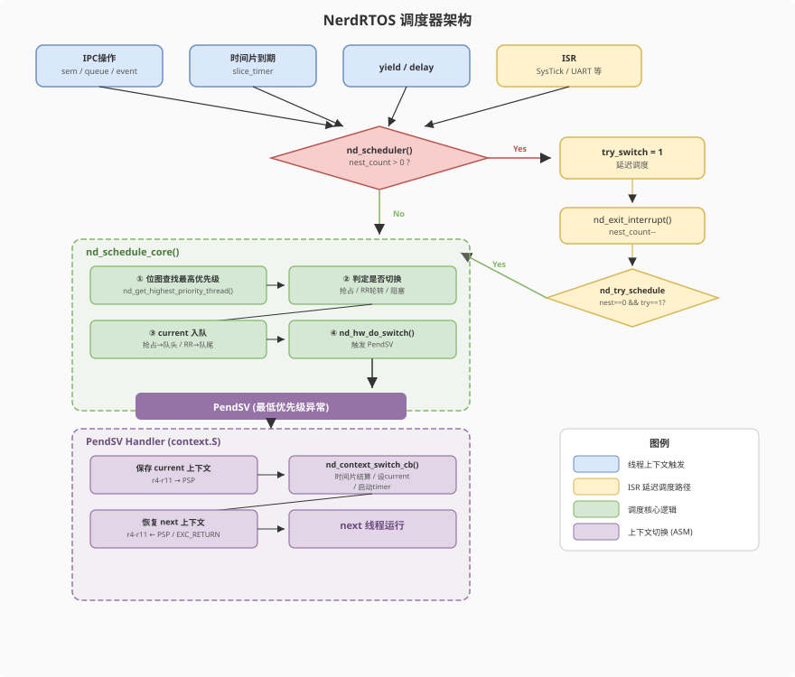

# NerdRTOS调度器系统设计说明

## 设计概述

调度器是RTOS内核的核心组件，负责决定哪个线程获得CPU的执行权。其意义主要体现在以下几个方面：
- 实现多任务并发执行，合理分派CPU资源。
- 通过优先级抢占机制保证实时任务响应
- 通过时间片轮转来保证同优先级任务的公平调度

## NerdRTOS调度器设计思想
NerdRTOS采用了基于优先级的抢占调度策略。系统支持32个优先级（数字越小优先级越高），使用**位图**+**每个优先级一个链表**实现复杂度O(1)的最高优先级查找。

## 工作流程：
#### 1.选出`next`线程:
选出下一个要执行的`next`线程，也就是查找当前优先级最高的线程。
``` c
    nd_thread_t *next = nd_get_highest_priority_thread();
```
采用了**位图** + **每个优先级一个链表** 实现O(1)复杂度快速查找。

> **为什么使用位图？**
>
>在没有**CLZ**硬件指令的处理器上，纯位运算求最低位需要循环或多次分支。而查表法是O(1)、无循环、指令数固定，时间完全可预测。

#### 2.判断是否需要切换
有三种情况需要切换：
- 更高优先级抢占
- 同优先级时间片轮转
- 当前线程被设置为阻塞（比如delay）

#### 3.把`current`线程按放入就绪队列
有两种情况：
- **被高优先级抢占**：将`current`加入队头，减少周期性高优先级线程打断造成的偏置
- **同优先级时间片轮转**：加入队尾，并且要补满时间片。

#### 4.触发切换
触发PendSV，保存`current`上下文到`PSP`之后，进入c回调`nd_context_switch_cb`。

在回调中我们进行进行:
- **时间片结算** : 切出时按实际运行时间扣减 slice_left（被高优先级抢占时保留剩余配额）,同优先级轮转时由调度核心把 slice_left 重置为满额
- **设置当前线程**    : 将`next`设置为当前线程
- **启动时间片定时器** ：仅当**存在同优先级就绪线程**时才启用

## ISR安全
>ISR运行在中断上下文中，不拥有独立的线程控制块和可调度的上下文。如果在ISR中强行触发上下文切换，会导致中断栈帧与线程上下文混淆，造成栈损坏和不可预测的行为。因此，ISR中真正的上下文切换必须**延迟到中断退出时再执行**。

``` c
void nd_scheduler(void)
{
    if (nd_interrupt_nest_count > 0) {
        nd_interrupt_try_switch = 1;
        return;
    }

    nd_schedule_core();
}
```
可以看到，`nd_scheduler`里面如果在中断里，只置标志位，不做切换。

NerdRTOS通过维护一个中断嵌套计数`nd_interrupt_nest_count` 和 切换标志位`nd_interrupt_try_switch`，确保了只有在非中断情况下才能触发上下文切换。
``` c
void nd_try_schedule(void)
{
    if (nd_interrupt_nest_count > 0) {
        return;
    }

    if (nd_interrupt_try_switch == 0) {
        return;
    }
    nd_interrupt_try_switch = 0;

    nd_schedule_core();
}
```



